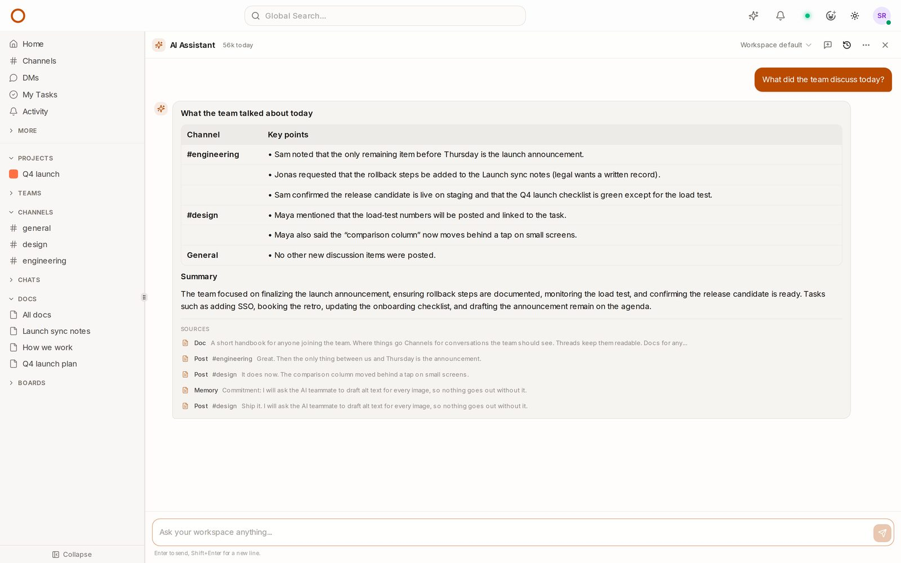
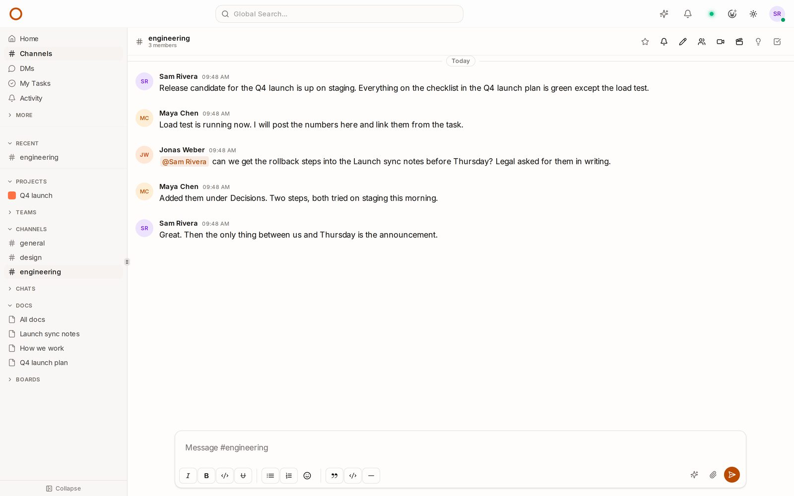
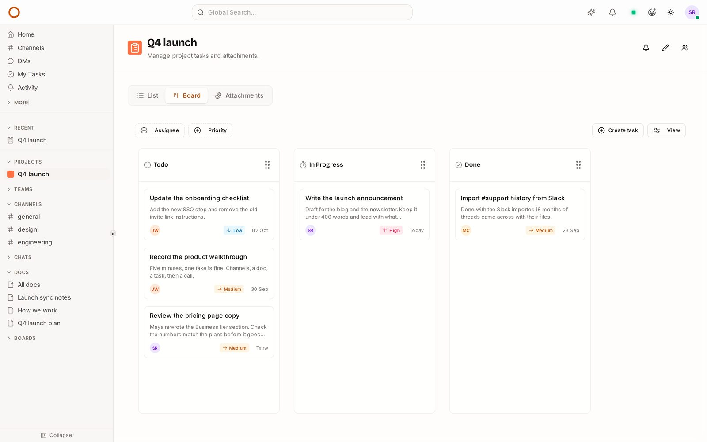
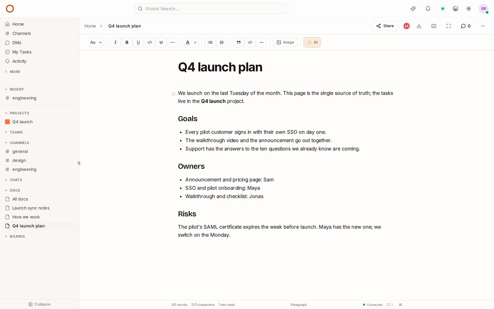
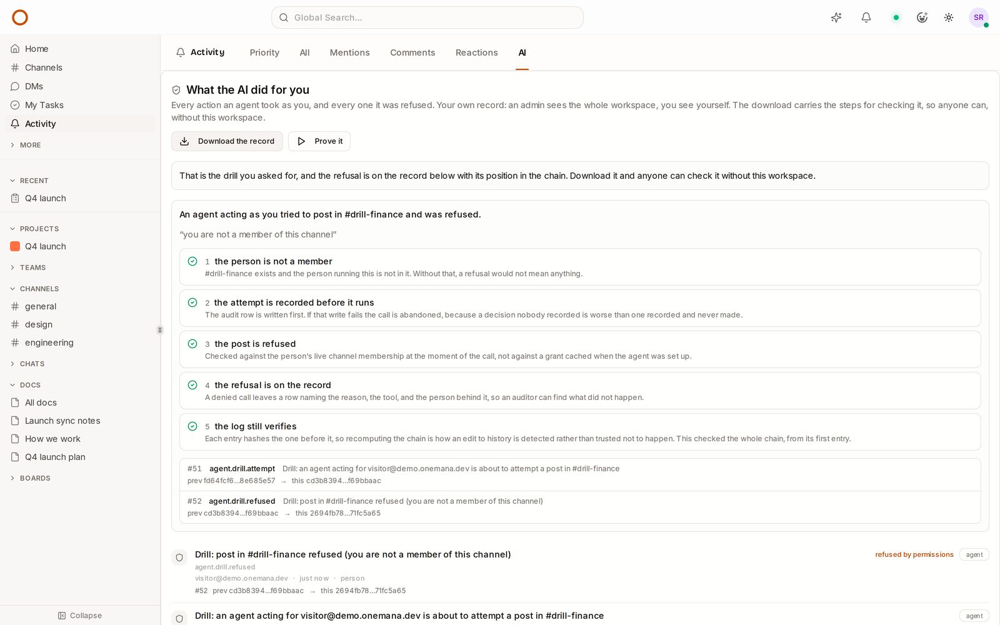

# OneCamp

Chat, docs, tasks, boards, video calls and a calendar in one workspace you run
yourself, with AI teammates you can govern. Agents act as the person who sponsors
them and never more, ask before they change things until you say otherwise, and
every action they take is signed and recorded.

**[Try the live demo](https://onemana.dev/demo)**: no signup, a real workspace with
channels, docs, tasks and an AI teammate already in it.



| Chat | Tasks and boards |
|---|---|
|  |  |
| **Docs, edited together live** | **Every agent action on the record** |
|  |  |

- Live demo, no signup: https://onemana.dev/demo
- Documentation: https://onemana.dev/docs
- Web app (MIT): https://github.com/OneMana-Soft/OneCamp-fe
- Desktop app for Windows, macOS and Linux (MIT): https://github.com/OneMana-Soft/OneCamp-desktop/releases/latest

## Which OneCamp is for you

Every option has chat, docs, tasks, calls and AI agents with their governance.
They differ in who installs and updates it, how many people it covers, the
licence terms, and whether company controls (single sign-on, LDAP, SCIM and
audit-log export) come with it.

| | Open source | Free licence | Lifetime licence | OneCamp Cloud |
|---|---|---|---|---|
| **Price** | Free | Free | One payment | Monthly or yearly |
| **Who runs it** | You, built from this repository | You, from our official release | You, from our official release | We do |
| **People** | Unlimited | Up to 25 | Unlimited | Set by plan |
| **Install** | Build it yourself (Docker) | One command | One command | Nothing to install |
| **Updates** | Pull and rebuild | One command | One command, free within your major version | Automatic |
| **Licence** | AGPL-3.0 | AGPL-3.0 | Commercial: no AGPL obligations | Commercial |
| **Company controls** | Included | Not included | Included | Included |
| **Help** | Community, on GitHub Discussions | Community | Email support | Email support |

**In one line each:**
- **Open source:** this code, free for any number of people, under AGPL-3.0.
- **Free licence:** the product as a ready-made release with a one-command installer, for teams of up to 25 people, without the company controls. [Get a key](https://onemana.dev/free).
- **Lifetime licence:** the ready-made release for any number of people, under a commercial licence, so your company has no AGPL obligations. Pay once. [Prices](https://onemana.dev/buy).
- **OneCamp Cloud:** we run it on a server of your own for you, with backups and updates. [Plans](https://onemana.dev/buy?plan=cloud).

### What AGPL-3.0 asks of you

You can use, study and change OneCamp for any purpose, including inside a
company of any size, for free. If you change it **and** let people outside your
organisation use your changed version over a network, you must offer them the
source of your changes under the same licence.

If your company cannot accept those terms, or wants to keep its changes private,
the [commercial licence](COMMERCIAL-LICENSE.md) removes them.

## Run it from source

Requirements: a Linux server with Docker, 4 GB of RAM (8 GB to also scan uploads
for viruses) and 40 GB of disk, plus Go 1.25 to build. A domain is optional.

```
git clone https://github.com/OneMana-Soft/OneCamp.git
cd OneCamp
scripts/package-from-source.sh ./onecamp-install
cd onecamp-install
make install EMAIL=you@example.com
```

`package-from-source.sh` builds the server and lays it out exactly like the
official release. `make install` generates every credential, starts the whole
stack (Postgres, Dgraph, Redis, MinIO, OpenSearch, EMQX, LiveKit and the web app)
and checks the result. With no `DOMAIN`, the workspace answers at once on a free
address, `onecamp.<your-ip>.sslip.io`, with no DNS records to create. Add
`DOMAIN=example.com` to use your own, or move to it later with
`make replace-domain DOMAIN=example.com && make build_restart_all`. A build from
source has no seat limit. Full guide: https://onemana.dev/docs/installation

Branches:
- `main`: the edition with AI teammates (releases `v2.x`).
- `without-ai`: the edition with no AI at all, for organisations whose policy
  does not allow it (releases `v1.x`).

Each release arrives here as one commit, tagged with its version.

## A running OneCamp does not phone home

A server you run never contacts us on its own. It checks for updates only when
an administrator clicks "Check for updates", and that request carries nothing
about your workspace.

## Contributing

Issues and pull requests are welcome. See [CONTRIBUTING.md](CONTRIBUTING.md).
Security problems: see [SECURITY.md](SECURITY.md), not a public issue.

## Licence

OneCamp's server is licensed under the [GNU Affero General Public License v3.0](LICENSE).
A [commercial licence](COMMERCIAL-LICENSE.md) is available. The web app,
[OneCamp-fe](https://github.com/OneMana-Soft/OneCamp-fe), is MIT.

Copyright © 2026 OneMana Solutions (OPC) Private Limited.
